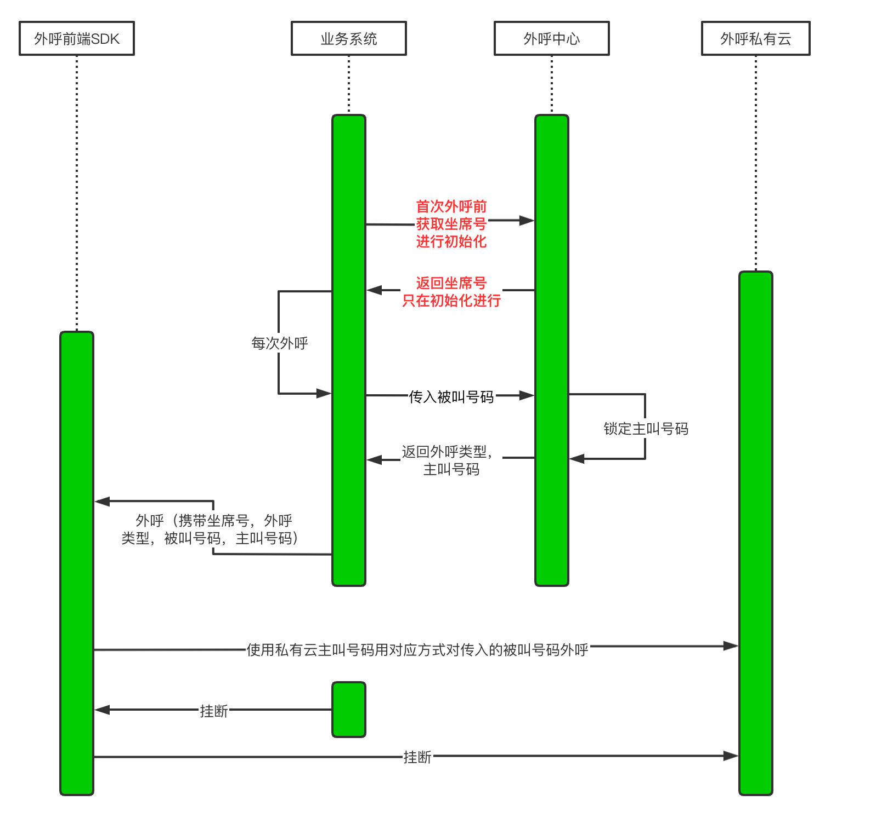
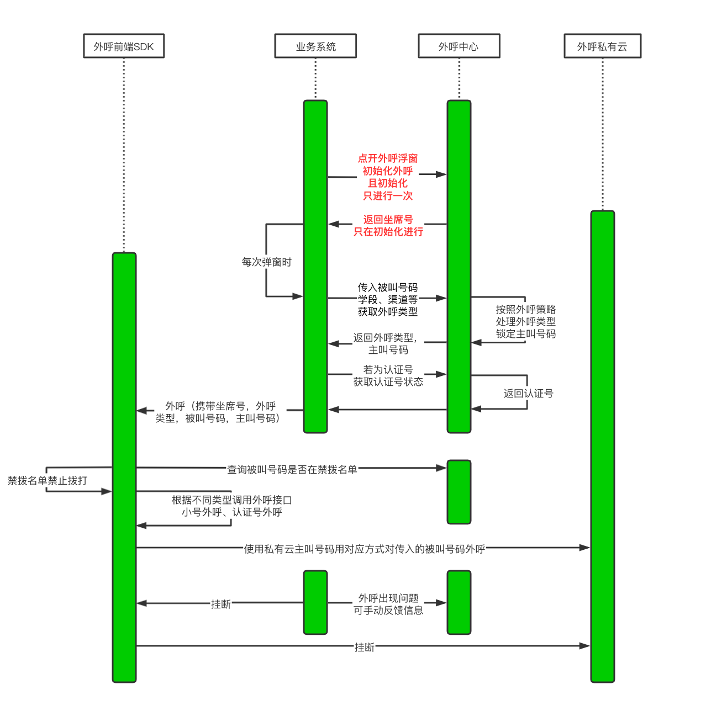

# 我为业务封装了一个外呼SDK

在公司的业务中有一些场景有用到外呼通话的，目前采用的是**第三方外呼SDK + 私有化外呼服务 + 服务端研发的外呼中心**的模式，
初版外呼就这么颤颤巍巍的跑过了挺长时间。但随着一些配合业务的更新迭代，遇到了不得不解决的问题。

## 旧的外呼结构

先解释一下👆上面提到的模式中不同模块负责的是什么事情：

浏览器本身想要实现打电话的功能就需要封装WebRTC和一个通话服务联通，然后通过通话服务和运营商的联通，实现该能力。我们很难自己去实现这样的架构，
这其中涉及到了通话资源，运营商服务，前端的语音能力，通话的信令同步等很多难点。因此我们选择直接采买第三方通话服务商来帮助业务拥有打电话的能力。

- 第三方外呼SDK：即就是前端实现麦克风录音，联通外呼服务的能力的代码包。
- 私有化外呼服务：为了数据的安全性，提供与运营商通话能力的外呼服务被部署在了我们内部机器上。
- 外呼中心：这是我们自己根据通话策略研发的一个资源分配服务，用来分配不同的坐席和号码资源，根据业务场景做一些特定的业务控制。
- 坐席：登录外呼的实际账号，可以理解成一个坐席对应一个可以打电话的位置，位置是固定的，具体数量取决于财力，买多少有多少。

👨‍👩‍👦 那么这几者的关系可以简述为一个完整的外呼流程：

- 外呼动作开始，外呼中心分配一个坐席给用户。
- 用户登录该坐席到私有化的外呼服务中，指定被服务对象进行外呼，传入被服务对象的号码给外呼中心。
- 外呼中心分配主叫号码与策略给当前坐席（此时被分配的主叫号码就被锁住，不会再分配给别的坐席）。
- 进行呼叫动作，挂断后，解锁主叫号码。

> 图中提到的主叫号码其实一开始没有起到决定作用，一开始我们所用方案都采用的认证号与固话，无需特别指定主叫号码，直接调用SDK外呼方法，呼通后，用户的手机会显示企业名称或是北京上海的座机号码。

## 后来的迭代

在很多接通场景下，外呼被接听的概率很低，主要有以下几方面的原因：

- 固话会被标记成骚扰电话。
- 认证号在某些地区会被运营商拦截，或是不显示认证内容，也会被误认为骚扰电话。
- 用户明确告知不需要提供服务，但可能还会被其他员工外呼打扰。
- 外呼服务商提供的服务出现问题导致很多无法打通的情况。

### 解决问题

遇到问题自然就需要解决问题，点对点，想办法整合对策。

被认定为骚扰电话的号码无非是两种情况，被标记的固话和无法被识别的认证号。其实相较于固话，我们可以提升认证号的权重，多使用认证号去拨打电话，
等认证号和固话都无法拨通后在尝试别的联系方式。此时，外呼服务商也提供给我们一种新的外呼资源：小号外呼。

小号外呼的本质其实就是真正的11位手机，我们可以购买一批全国各地的小号资源作为主叫号码进行拨打。

### 设计方案

最开始有提到的一个概念：号码资源。其实外呼中心分配的资源不仅有坐席号，还有号码（固话、认证号、一批小号）。

号码资源：拨通电话后，被叫号码显示的号码，不同的外呼号码的接通概率是不一样的，当然成本也不一致。而这里的成本指的是外呼的限制，国家对外呼业务的管控十分严格，
不同主叫号码与被叫号码可拨打的次数都会被严格把控，在一个很低的次数。因此我们将主叫与被叫整理为号码资源，再每次外呼的时候，合理分配，严格把控，以保证外呼系统稳定不违规。

禁拨名单：在被明确告知了不需要被外呼拨打的用户，为了防止再次被打扰，可以将他们的联系方式放到禁拨的池子中，以防止被再次打扰，减少投诉。

反馈信息：外呼不通的情况也包含线路上问题，实际场景五花八门，因此也需要维护一个反馈池子，收集从业务提供过来的外呼不通的情况，结合本通外呼的信息做整理，作为系统维护方向。

## 目前的外呼架构

实际上，由于上述设计的方案不是一次性而是逐步迭代的，加上一些内部因素（沟通障碍 + 理解业务障碍），使得外呼流程成了下图所示：

## 外呼流程

我们将外呼SDK封装在一个弹窗中，每次弹窗弹起时，会获取策略，让外呼中心分配号码资源并锁定。如果是选定小号外呼就验证是否在禁拨名单中，校验通过后，进行外呼。
如果是选定认证号拨打，就需要在校验禁拨名单前校验认证号在被叫号码所在城市是否可用，不可用使用固话。

## 存在问题

大概一看，功能做的是很全面。但是这个流程前面也有埋下伏笔提示其实有很大的问题，如果我们细看该流程最明显是可以看到一通电话要发的请求太多了。而问题不止是表面：

- 一通外呼需要连续发送请求来确定最终的外呼要素，链路的节点多一个，会失败的因素就会多一个。并且在密集外呼场景下，并发量高，存在反复锁定解锁号码资源的处理，对外呼中心压力很大。
- 每次只有弹窗的时候才会进行资源的获取，如果在一个弹窗下要打两通电话，那么第二通电话使用的号码资源，是被外呼中心所不知道。假设我们呼完一通电话后，
外呼中心解锁了号码资源，我们在未关闭弹窗的情况下再次外呼，此时外呼中心已经将号码资源分配给别的坐席，那么就会出现号码外呼的并发情况。
- 而在外呼弹窗出现，而又不外呼的情况下，号码资源将一直被锁定，造成资源浪费。
- 外呼中心与业务系统交互也与维护SDK交互，这并不合理，外呼中心理应只为外呼能力服务，即就是请求应该全在外呼SDK内部进行。

## 新的需求

而随着业务规模的扩大，外呼也需要被应用于不同业务场景下，因此就有了一批新的系统需要接入我们已经实践好的外呼模式。

很显然，我们现有的外呼模式是存在问题且不够灵活，接入一个新系统的成本过高。外呼中心本身也无法区分不同的业务方，这对成本计算也造成了不少问题。

因此，我们希望进行一次大的迭代，达到这样的目标：
